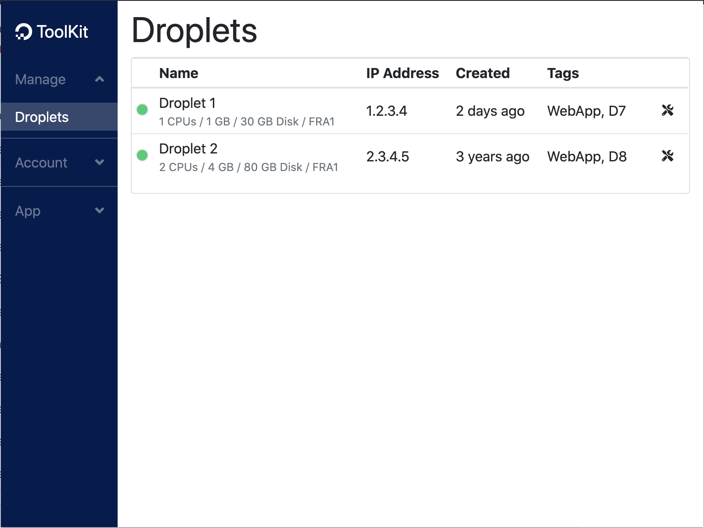
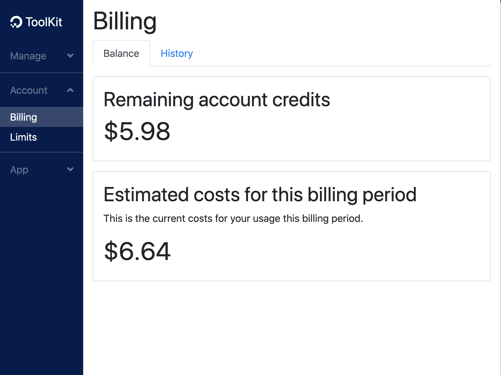
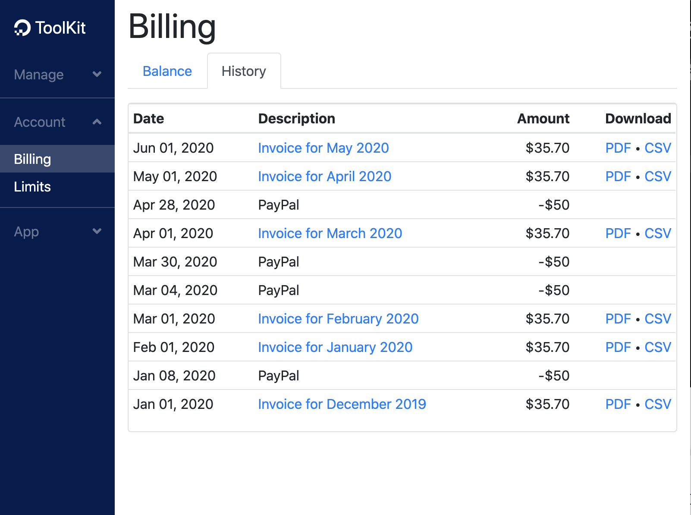

# DigitalOcean ToolKit

[](https://travis-ci.org/IT-Cru/digitalocean-toolkit)

With the DigitalOcean ToolKit browser extension it is possible to manage your DigitalOcean resources via APIv2 of DigitalOcean.

Get [DigitalOcean ToolKit](https://chrome.google.com/webstore/detail/digitalocean-toolkit/dkpdecgeaddlfilnhfkfiobidfifbpkl?hl=en) from chrome extension store.

## Features

This extension provides currently following features:

*   List and manage your droplets
*   List and manage your billings
*   Display current balance state
*   Display current account limits

More features are in planning. Please visit support page to get more information.

## Help

### Create DigitalOcean account

To use DigitalOcean ToolKit browser extension you need a DigitalOcean account. If you already have an account, you can directly go to next step "Prepare ToolKit...".

1.  Create your own DigitalOcean account.
2.  Verify your new created account.

Get your own DigitalOcean account with $100 free credits [here](https://m.do.co/c/1439b3e5bf3a).

### Prepare ToolKit for using DigitalOcean API

To use DigitalOcean ToolKit browser extension you need a personal access token with read and write permissions.

1.  Create your personal access token for example named as "ToolKit".
2.  Copy "ToolKit" personal access token.
3.  Open option dialog of DigitalOcean ToolKit browser extension.
4.  Paste copied personal access token into _API access token_ field.
5.  Save your settings.

Get your personal access token for DigitalOcean API [here](https://cloud.digitalocean.com/settings/api/tokens).

## Support

If you like the DigitalOcean ToolKit browser extension and want more features you can support in different ways.

* Use my [DigitalOcean referral link](https://m.do.co/c/1439b3e5bf3a) to create new DigitalOcean accounts.
* Use [paypal.me](https://paypal.me/ITCru "go to Paypal.me of IT-Cru") to donate for further development of DigitalOcean ToolKit.
* Leave a positive rating or review in browser extension store.
* Blog about the DigitalOcean ToolKit browser extension on your website.
* Share the DigitalOcean ToolKit extension with other DigitalOcean users you know.

### Bug reports and feature requests

Bug reports and feature requests are handled on Github. Before you create a new issue please take a look in current issue queue.  
Current issues: [https://github.com/IT-Cru/digitalocean-toolkit/issues](https://github.com/IT-Cru/digitalocean-toolkit/issues)

Please use following link to create a new bug report or feature request:  
Create new issue: [https://github.com/IT-Cru/digitalocean-toolkit/issues/new](https://github.com/IT-Cru/digitalocean-toolkit/issues/new)

## Screenshots







All brand names, product names, abbreviations and logos used on these pages are the property of the companies / groups concerned and are recognized as protected.

## Development

### Project structure

* src/typescript: TypeScript source files
* src/assets: static files
* dist: Chrome Extension directory
* dist/js: Generated JavaScript files

### Setup project

```
npm install
```

### Build project

```
npm run build
```

### Build project in dev mode

```
npm run watch
```

### Test project

```
npm run test
```
